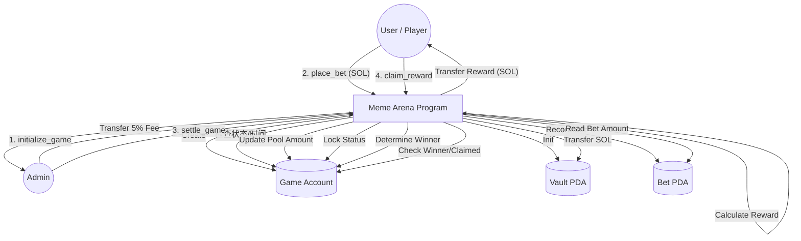

# Abstract Meme Arena - 合约功能汇总与流程图

## ✨ 合约核心功能 (Core Instructions)

我们的智能合约 (`meme_arena`) 主要包含以下 4 个核心指令，负责处理游戏的完整生命周期：

### 1. `initialize_game` (初始化游戏)
*   **作用**：创建一个新的游戏对局 (Topic)。
*   **输入**：
    *   `topic`: 游戏主题字符串 (如 "Kun vs Fan")。
    *   `deadline`: 游戏截止时间戳 (Unix Timestamp)。
*   **逻辑**：
    *   初始化 `Game` PDA 账户。
    *   设置管理员 (`authority`)、截止时间、初始状态为 `Open`。
    *   初始化红蓝双方资金池为 0 SOL。
    *   初始化 `Fee Vault` (默认为创建者)。

### 2. `place_bet` (下注)
*   **作用**：用户向红队 (A) 或蓝队 (B) 投注 SOL。
*   **输入**：
    *   `side`: 投注方向 (TeamA 或 TeamB)。
    *   `amount`: 投注金额 (Lamports)。
*   **限制**：
    *   游戏必须处于 `Open` 状态且未过期。
    *   **限制** (MVP): 每个用户每场游戏只能投一次 (由 `[b"bet", game, user]` PDA 种子约束)。
*   **逻辑**：
    *   创建并记录用户的 `Bet` PDA 账户。
    *   **资金划转**：将用户的 SOL 转入合约控制的 `Vault` (金库) PDA。
    *   更新 `Game` 账户中的对应资金池总额 (`total_pool_a` 或 `total_pool_b`)。

### 3. `settle_game` (结算)
*   **作用**：管理员判定赢家，结束游戏，并收取协议手续费。
*   **输入**：
    *   `winner_side` (可选): 管理员可强制指定赢家；若为空，则根据资金池大小自动判定 (钱多者赢)。
*   **逻辑**：
    *   比较 `pool_a` 和 `pool_b`，确定获胜方。
    *   将游戏状态更新为 `Settled`，写入获胜结果。
    *   **抽水 (Fee)**：计算总奖池的 **5%** 作为手续费，从 `Vault` 转给 `Fee Vault` (管理员地址)。

### 4. `claim_reward` (领奖)
*   **作用**：赢家用户领取奖金。
*   **限制**：
    *   游戏必须已结算 (`Settled`)。
    *   用户必须投中了赢家 (`bet.side == game.winner`)。
    *   该注单尚未领取过 (`!bet.claimed`)。
*   **逻辑**：
    *   **奖金公式**：`我的奖金 = (总奖池 - 手续费) * (我的下注额 / 赢家方总奖池)`。
    *   **资金划转**：从 `Vault` 将计算出的 SOL 转回用户钱包。
    *   标记 `bet.claimed = true` 以防止重放攻击/重复领取。

---

## 🗺️ 合约交互流程图 (Data Flow)

### Mermaid 流程图



### 简易文本流程图

```text
[ Admin ]
    |
    | (1) initialize_game
    v
+-----------------------+              +-----------------+
|   Meme Arena Game     |              |    Vault PDA    |
| Status: Open/Settled  |<-------------| (Holds all SOL) |
| Pools:  Red vs Blue   |              +-----------------+
+-----------------------+                       ^
    ^          |                                |
    |          | (3) settle_game (Fee 5% out)   | (2) place_bet (SOL in)
    |          v                                | (4) claim_reward (SOL out)
    |      [ Winner Decided ]                   |
    |                                           |
    | (2) place_bet (Record stored in Bet PDA)  |
    +-------------------------------------------+
    |
 [ User / Player ]
```
